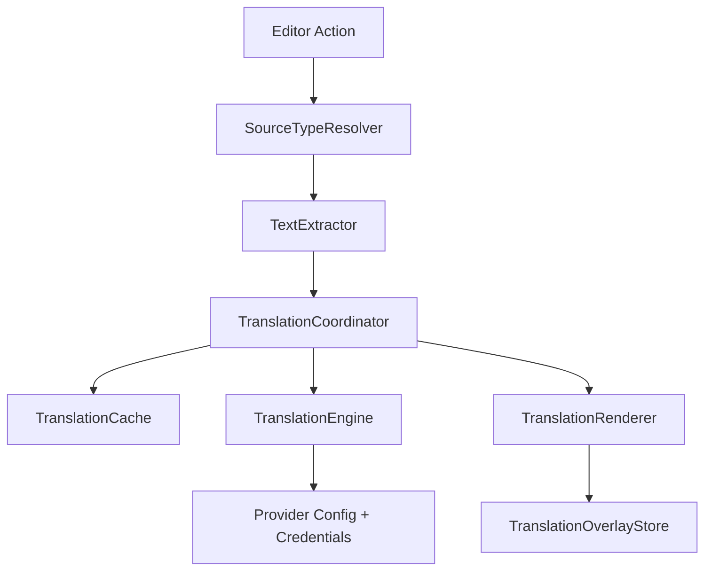

# Provider-first Immersive Translate Design

## Goal

Build a complete first version of the IntelliJ immersive translation plugin around a provider-first architecture. The first version must reliably clear inline translations, translate code comments, Markdown, and plain text files, and support multiple translation providers through one workflow.

## Current State

- `ImmersiveTranslateAction` always calls `SourceType.PSI_COMMENT`, so the plugin currently translates only PSI comments.
- `SourceType.MARKDOWN_BLOCK` exists, but no Markdown extractor is registered.
- Plain text files do not have a source type or extractor.
- `InlayRenderer` stores rendered inlays in an instance field. If clear uses a different renderer instance, old inlays can remain visible.
- Settings and credentials are modeled around one OpenAI key, base URL, and model. This does not scale to Google, Microsoft, Gemini, and OpenAI-compatible providers.

## Scope

### In Scope

- Make inline translation clearing reliable for the current editor.
- Add a toggle-style action: if translations are visible, clear them; otherwise translate.
- Add Markdown translation for normal prose blocks.
- Add plain text translation for paragraph-style files.
- Add a provider-first engine configuration model.
- Support these providers in one engine registry:
  - OpenAI / OpenAI-compatible LLM translation
  - Gemini LLM translation
  - Google Cloud Translation
  - Microsoft Translator
- Store provider credentials separately.
- Add focused unit tests for extraction, clearing, provider parsing, and coordinator behavior.

### Out of Scope

- True multi-step autonomous agent workflow that reads arbitrary project context.
- Translation memory persistence beyond the existing in-memory cache.
- Glossary management UI.
- Batch document translation outside the open editor.
- Streaming display.
- Editing source files with translated text.

## Recommended Architecture

Keep `TranslationCoordinator` as the central workflow, but make it source-aware and provider-aware:



The important change is that render state moves out of transient renderer instances and into a shared overlay store. Providers remain behind the existing `TranslationEngine` interface, but each engine reads a typed provider configuration.

## Inline Display and Clearing

### Design

Introduce `TranslationOverlayStore` as a project-level service.

Responsibilities:

- Track rendered overlays by editor and segment ID.
- Dispose one segment's overlay.
- Dispose all overlays for an editor.
- Report whether an editor currently has visible translation overlays.

`InlayRenderer` becomes a thin renderer:

- `render()` clears any existing overlay for the same segment, creates the block inlay, and registers it in the store.
- `clear()` delegates to the store.
- `clearAll()` delegates to the store.

`ToggleTranslationAction` should call:

- `coordinator.hasVisibleTranslations(editor)` then `clear(editor)` when true.
- `translate(editor, scope)` when false.

This fixes the current failure mode where clear cannot find inlays created by another renderer instance.

## Source Selection

### SourceType

Extend the model:

```kotlin
enum class SourceType {
    PSI_COMMENT,
    MARKDOWN_BLOCK,
    PLAIN_TEXT_BLOCK,
    CONSOLE_LINE,
    QUICK_DOC,
}
```

### SourceTypeResolver

Add a resolver that chooses source type from the current editor:

- Markdown file types and `.md`/`.markdown`: `MARKDOWN_BLOCK`
- Plain text file types and `.txt`/`.text`: `PLAIN_TEXT_BLOCK`
- Otherwise, if PSI is available: `PSI_COMMENT`

The action should stop hardcoding `PSI_COMMENT`.

## Markdown Extraction

Add `MarkdownBlockExtractor`.

Rules:

- Translate headings, paragraphs, block quotes, and list item text.
- Skip fenced code blocks.
- Skip indented code blocks.
- Preserve inline code text by not extracting code-only spans.
- Skip front matter blocks at the start of a file.
- Skip blank lines, horizontal rules, and URL-only lines.

The first implementation can be line/paragraph based instead of adding a Markdown parser dependency. This is enough for editor inline display because the renderer anchors translations to existing source ranges.

## Plain Text Extraction

Add `PlainTextBlockExtractor`.

Rules:

- Split on blank-line paragraph boundaries.
- Support current line, selection, visible area, and whole file scopes.
- Skip blank paragraphs, symbol-only paragraphs, and extremely short fragments.
- Anchor each segment to the paragraph range.

## Provider-first Translation Engines

### Provider Types

Use one engine interface, but classify implementations:

```kotlin
enum class ProviderKind {
    MACHINE_TRANSLATION,
    LLM_TRANSLATION,
}
```

Provider IDs:

- `openai`
- `gemini`
- `google-cloud-translate`
- `microsoft-translator`
- `openai-compatible`

### Configuration Model

Add persistent settings fields grouped by provider:

- Active provider ID
- Target language
- Provider config map
- Renderer ID
- Cache max entries

Provider config should include non-secret fields only:

- OpenAI/OpenAI-compatible: base URL, model
- Gemini: model
- Google Cloud Translation: project ID, location, model name, MIME type
- Microsoft Translator: endpoint, region, source language optional

Secrets stay in `PasswordSafe`:

- OpenAI API key
- Gemini API key
- Google credential material or bearer token strategy
- Microsoft subscription key

### OpenAI / OpenAI-compatible

Keep the current OpenAI implementation as the first LLM engine. Add an OpenAI-compatible variant by making base URL and provider ID configurable.

OpenAI's current official guidance positions the Responses API as the recommended model response interface. Migration can be a follow-up because the existing Chat Completions flow already works, but new agent-style work should target Responses. Source: [OpenAI Responses Overview, 2026](https://developers.openai.com/api/reference/responses/overview/).

### Gemini

Implement Gemini as an LLM translation engine using `models.generateContent`.

Official API constraints:

- Endpoint: `POST https://generativelanguage.googleapis.com/v1beta/{model=models/*}:generateContent`
- Required request field: `contents[]`
- Optional `systemInstruction` and `generationConfig` are useful for stable translation output.
- Source: [Google AI Gemini generateContent, last updated 2026-04-24](https://ai.google.dev/api/generate-content).

### Google Cloud Translation

Implement Google Cloud Translation as a machine translation engine.

Official API constraints:

- Endpoint: `POST https://translate.googleapis.com/v3/{parent=projects/*}:translateText`
- Required body fields: `contents[]`, `targetLanguageCode`
- `mimeType` should be set to `text/plain` for editor segments.
- Google recommends total content below 30,000 codepoints; the documented `contents[]` field has max length constraints, so batching must be conservative.
- Source: [Google Cloud Translation `projects.translateText`, last updated 2025-04-30](https://docs.cloud.google.com/translate/docs/reference/rest/v3/projects/translateText).

### Microsoft Translator

Implement Microsoft Translator as a machine translation engine.

Official API constraints:

- Endpoint: `POST https://api.cognitive.microsofttranslator.com/translate?api-version=3.0&to=...`
- Request body: JSON array of objects with `Text`.
- Required content type: `application/json; charset=UTF-8`
- Authentication headers are required; region header is required for regional or multi-service Azure resources.
- Source: [Microsoft Learn Translator v3 Translate](https://learn.microsoft.com/en-us/azure/ai-services/translator/text-translation/reference/v3/translate).

## Prompt Strategy for LLM Providers

LLM engines must preserve segment count and ordering.

Prompt rules:

- Translate developer-facing text to the configured target language.
- Preserve Markdown syntax where present.
- Do not translate code identifiers, URLs, fenced code, placeholders, or inline code.
- Return one result per segment in order.
- Use a delimiter or structured JSON response where supported.

For Gemini, prefer JSON output when stable enough; otherwise use the existing delimiter strategy with strict count validation.

## Error Handling

Map provider failures into `TranslationError`:

- Missing credential: `NoApiKey`
- Timeout: `NetworkTimeout`
- HTTP 429: `RateLimited`
- HTTP 4xx/5xx with provider message: `ApiError`
- Response shape mismatch: `Unknown`

The coordinator should not render partial corrupted output when result count does not match segment count.

## Testing Strategy

Use Level 1 regression tests plus targeted TDD for new extractors and provider parsers.

Required tests:

- `InlayRendererTest`: clear works across renderer instances through shared store.
- `TranslationCoordinatorTest`: toggle/clear path delegates to renderer/store correctly.
- `SourceTypeResolverTest`: Markdown, text, and code files resolve to expected source type.
- `MarkdownBlockExtractorTest`: extracts prose and skips fenced code/front matter.
- `PlainTextBlockExtractorTest`: splits paragraphs and respects selection scope.
- `GeminiEngineTest`: builds request and parses successful response.
- `GoogleTranslateEngineTest`: builds request and parses `translatedText`.
- `MicrosoftTranslatorEngineTest`: builds request, headers, and parses first translation.
- `SettingsPanelTest` or service tests: provider-specific settings and credential keys do not overwrite each other.

## Rollout Plan

Implement in this order:

1. Stabilize overlay clearing.
2. Add source type resolution and text/Markdown extractors.
3. Refactor settings and credential storage for multiple providers.
4. Add Gemini.
5. Add Microsoft Translator.
6. Add Google Cloud Translation.
7. Update README and manual test plan.

This order keeps user-visible correctness first, then expands coverage and providers.

## Acceptance Criteria

- Running translation on a code file still translates Java/Kotlin comments.
- Running translation on Markdown translates normal prose and skips code blocks.
- Running translation on plain text translates paragraphs.
- Running clear after translation removes all visible inlays in the current editor.
- Triggering the toggle action while translations are visible clears them.
- OpenAI, Gemini, Microsoft, and Google provider options are available in settings.
- Each provider uses isolated credentials.
- Failed provider calls produce a notification and leave no corrupted inline state.
- Focused unit tests pass.

